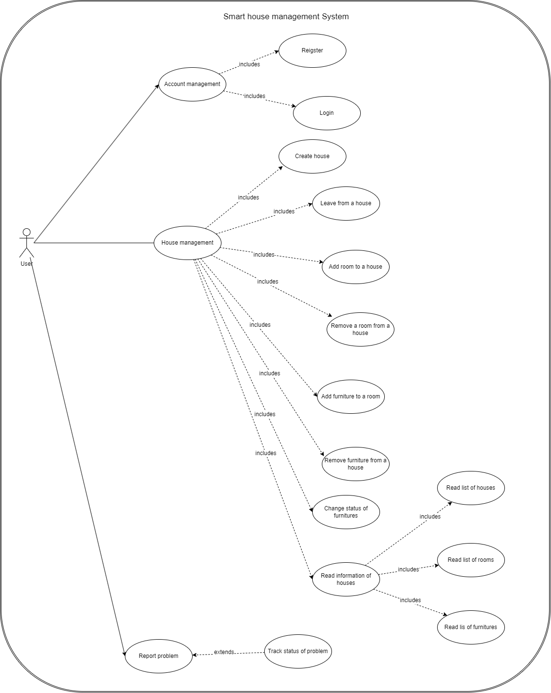

## Рефакторинг баз данных и приложение

### Сценарий 2: Рефакторинг существующего программного проекта

 Студент:

* Ляо Ихун

#### Описание проекта

Веб-сайт для управления умным домом, которые делано для курсовой работы по дисциплине База Данных. Бэк создан на базе Spring Boot и фронт создан в фреймворке material-ui.  Будем делать рефакторинг бэк. Приложение использует СУБД PostgreSQL хранения данных.

 #### План итерации

**1)Стандартизация Restful и структурная перестройка**

* Перестроить чтобы там не каждый контроллер только отвечает за один запрос.
* Переименование url чтобы все они были читаемы и совпадали с соглашением resutful.
* В ответе от сервера должно есть код состояния.

Результат(в начале звук немного громкий. Пожалуйста, отрегулируйте громкость перед открытием файла. ):

https://drive.google.com/drive/folders/1MqL2Eyvz4fe9y-6v-AIMoIr_8Hkr5z1f?usp=sharing

**2)Разграничение доступа**

* Реализовать spring security а не свою логику
* Информации пользователи сохраняются в базе данных.
* После аутентификации пользователь получает токен. И последующая авторизация осуществляется через токены.

**3)Добавить функции удаления**

функции удаления не доделаны. Нужно добавить:

* Функция удаления дома из своего аккаунта
* Функция удаления комнаты из своего дома
* Функция удаления мебели из своего дома
